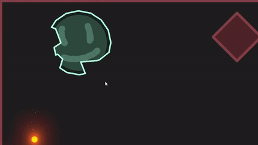
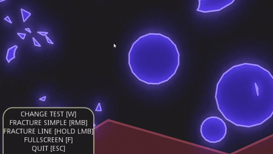
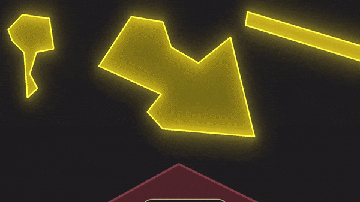
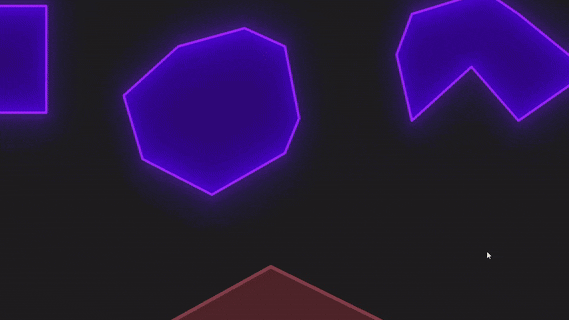
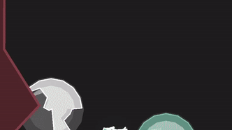

# godot-polygon2d-fracture

## UPDATES
- UPDATE v1.4.0 adds polygon restoring - simple and advanced
- UPDATE v1.3.0 texture system + point fracture system + big cleanup
- UPDATE v1.2.0 overhaul of mouse cut system + important bug fixes + pool manager script (bonus) + "juice".
- UPDATE v1.1.0 adds cutting of polygons.

## Info

Works with GodotEngine 3.2+
Tested with Godot Versions: 3.2.3, 3.3, 3.3.1

Two simple scripts for fracturing and cutting polygons. PolygonFracture.gd is the actual script that fractures/cuts polygons. PolygonLib.gd adds nice helper functions for polygons like calculateArea, triangulate, getRandomPointsInPolygon, getBoundingRect, makeCirclePolygon, etc.

The final scripts are located in the polygon2d-fracture folder.
The demo project is located in the demo folder.

The pool manager script added in [Update v1.2.0] is just a bonus. You can use it as is or use it as inspiration for your own pooling system :)

You can download/play the demo on [itch.io.](https://solobytegames.itch.io/godot-polygon-2d-fracture-system) :D

## Point Fracture
Originally I wanted to do a more sophisticated point fracture system but it always turned out to be a complicated mess. Finally I figured out a simpler way with using the already implemented Cut-Fracture system. I added a func to generate a randomized polygon and with a point (like a collision point), this randomized polygon can be used in the cut fracture method.

In this gif you can also see that polygons with textures can now be cut/fractured too :) 

## Cut Method

There is just one cut method. It uses 1 polygon as the source and 1 polygon as a cut shape. The intersected shape (the parts overlapping in both polygons) can be fractured if desired. I also added helper funcs to PolygonLib.gd to create simple polygon shapes (currently: rectangle, circle, beam).

[Update v1.2.0] overhauled the mouse cut system for the demo project. The input system was unified to 1 button so it works on touch screens too. (HOLD LMB for cut lines, Tap LMB for simple circle cut)

### NEW CUT METHOD
-readme02.gif)

### OLD CUT METHOD

## Fracturing Methods

There are two different systems for fracturing polygons.
 - Delaunay Fracture -> uses the delaunay triangulation to calculate random triangles inside the polygon. DelaunyFractureConvex assumes the polygon is convex and     DelaunyFractureRectangle assumes the polygon is a rectangle (convex/rectangle makes the fracturing simpler). Produces triangle fractures.
 - Fracture -> uses randomly generated cut lines to actually cut the polygon. Fracture and Fracture simple have different methods of obtaining the random cut lines but are otherwise the same. Produces polygon fractures.

### Delaunay System

### Cut Line System

## Restoring

I added two different methods of restoring polygons to their original state. 

### Simple
The simple method uses the polygonRestorer.gd script. This is a simple class with an array(stack) of polygons. Each polygon represents a state. The last element represents the previous polygon, the first element represents the original polygon. The user can add new shapes, get the original state, the current state or the previous state with simple functions. 

### Advanced
The advanced method just uses 1 function in the polygonLib.gd script. The simple method stores the states of the polygon and can restore each state. The advanced method grows the polygon by a certain amount while restricting it to the original polygons shape. In other words: the simple method can only restore discrete states while the advanced method can restore any amount in between. Unfortunately the advanced method comes with a bigger performace cost. As seen in the demo, it should not be a problem using it every now and then but restore intervals below about 0.2 seconds can slow things down significantly.

I would suggest just testing it because as always it depends on how and for what you want to use it ;)

I need the fracturing for my game but I thought I share it with anyone interested. My method is not the best or most performant method out there, and also implemented via GDScript (for ease of use), so don´t expect any performance miracles. There are other solutions out there, but I did not find a simple solution for fracturing 2d polygons in the way I wanted. Maybe sometime in the future, I will look into Voronoi fractures, to make the fractures look better. (Now the polygon is just randomly fractured)

## Other Solutions
- goost (https://github.com/goostengine/goost) for example, but requires building Godot from source
- Godot-3-2D-Destructible-Objects (https://github.com/hiulit/Godot-3-2D-Destructible-Objects) but only works for sprites
